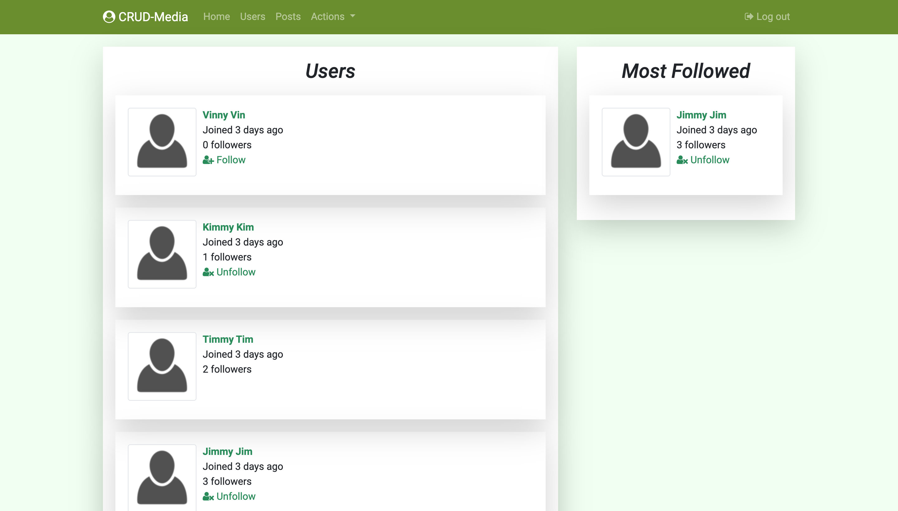

# CRUD Media

## Preview:

## Heroku link:
https://crud-media.herokuapp.com/

## Features:

* Create user accounts

* Create, edit, and delete posts

* Comment on and like posts

* Add tags to posts

## Information:

* Ruby version: 2.6.3

* Rails version: 6.0.3

* Bootstrap version: 4.4.1